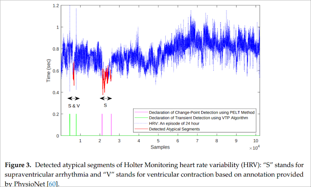

+++
title = 'Atypicality Presentation Recap'
date = 2019-05-13
draft = false
toc = false

[taxonomies]
tags = ["anomaly"]
+++

Yesterday, I gave a presentation introducing the ideas of atypicality to the Monteleoni research group. These are the [slides](https://drive.google.com/open?id=1ZuS7SouTQkhWekoCaeU9SS-jrAN_AFp5) and [handwritten notes.](https://drive.google.com/open?id=1HHjwAtoR2jiGyYyewbUbqyi3EBqP0CZF) I plan to explore this idea further and write up better LaTeX notes, which I will then share as well. For now, the idea of atypicality centers around using two coders: one trained to perform best on typical data and one that is universal and not data specific. A sequence is atypical if its code length using the typical coder is longer than the universal coder, i.e. it is not favored by the typical coder indicating the information is somehow unique.

An example of the usage of atypicality from their 2019 paper "Data Discovery and Anomaly Detection using Atypicality for Real-valued data."

I presented on Elyas Sabeti and Anders H⊘st-Madsen's [2016 paper titled "How interesting images are: An atypicality approach for social networks"](https://ieeexplore-ieee-org.colorado.idm.oclc.org/abstract/document/7840742). I think there are lots of opportunities for development in the image space, e.g. using different representations of images maybe including deep learning, exploring what made those images interesting by training a supervised classifier on the resulting labels and exploring the learned features. I'm concerned that their atypicality could be keying on background features, a lot more investigation is needed to understand the details of this application. I also think the image application needs more rigorous validation. They could have tested against other kinds of images to see if they also were labeled as atypical. One idea that was suggested by a member of our group (Amit Rege) is using the atypicality idea in a down-stream application to speed up stochastic gradient descent by picking atypical examples to learn from.

A list of atypicality papers, by Sabeti & H⊘st-Madsen:

* [Information theory for atypical sequences (2013)](https://ieeexplore.ieee.org/abstract/document/6691276/)
* [Data discovery and anomaly detection using atypicality: theory (2017)](https://arxiv.org/abs/1709.03189)
* [Atypicality for vector gaussian models (2015)](https://ieeexplore.ieee.org/abstract/document/7418211/)
* [Atypicality for the class of exponential family (2016)](https://ieeexplore.ieee.org/abstract/document/7852292/)
* [Enhanced MDL with application to atypicality (2017)](https://ieeexplore.ieee.org/abstract/document/8007125/)
* [Atypicality for Heart Rate Variability using a pattern-tree weighting method (2017)](https://arxiv.org/abs/1710.07319)
* [Data Discovery and Anomaly Detection using Atypicality for Real-Valued Data (2019)](https://www.mdpi.com/1099-4300/21/3/219)
