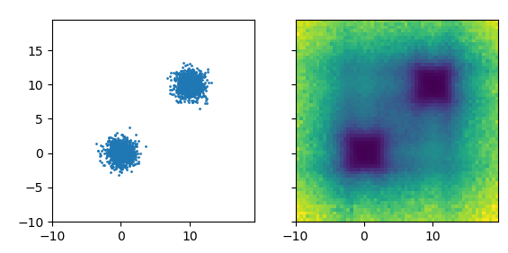
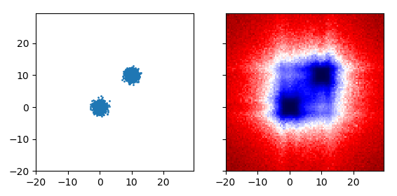
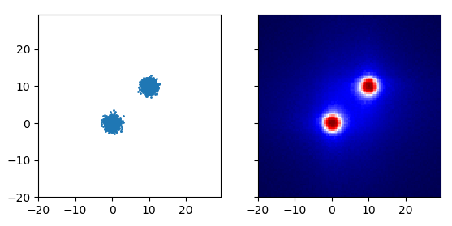

+++
title = 'Axis Aligned Artifacts for Robust Random Cut Forests'
date = 2019-10-07
draft = false
toc = false

[taxonomies]
tags = ["anomaly"]
+++

There are artifacts created by choosing axis aligned cuts in robust random cut forests, [similar to what was noted with IsoForest.](https://arxiv.org/abs/1811.02141).



Left: Original data distribution. Right: Learned co-displacement, darker is lower.



Notice the echoes around (10,-10) and (-10, 10)



If instead of either of these, you use the depth in the robust random cut forest, you get what's shown above. The first two examples are recreated by the code below:

```py
import numpy as np
import pandas as pd
import rrcf
import matplotlib.pyplot as plt

include_anomaly=False
# Construct data with two modes and full of anomalies
X1 = np.random.multivariate_normal([0,0], [[1,0],[0,1]], 1000)
X2 = np.random.multivariate_normal([10,10], [[1,0],[0,1]], 1000)
if include_anomaly:
    XA = np.random.uniform(-5, 15, size=200).reshape((100, 2))
    X = np.concatenate([X1, X2, XA])
else:
    X = np.concatenate([X1, X2])

# plot the original data
fig, ax = plt.subplots()
ax.plot(X[:,0], X[:,1], '.')
fig.show()

num_trees = 300
tree_size = 256
n = X.shape[0]

# Construct forest
forest = []
while len(forest) < num_trees:
    # Select random subsets of points uniformly from point set
    ixs = np.random.choice(n, size=(n // tree_size, tree_size),
                           replace=False)
    # Add sampled trees to forest
    trees = [rrcf.RCTree(X[ix], index_labels=ix) for ix in ixs]
    forest.extend(trees)

# prepare grid for codisp measurement
xvals, yvals = np.arange(-10, 20, 0.5), np.arange(-10, 20, 0.5)
nx, ny = len(xvals), len(yvals)
xv, yv = np.meshgrid(xvals, yvals)
codisp = np.zeros((nx, ny))

# measure codisp across space
for i in range(nx):
    for j in range(ny):
        temp = []
        for tree in forest:
            point = np.array([xv[i,j], yv[i,j]])
            tree.insert_point(point, index='test')
            temp.append(tree.codisp('test'))
            tree.forget_point('test')
        codisp[i,j] = np.mean(temp)

# plot codisp
fig, axs = plt.subplots(ncols=2, sharex=True, sharey=True)
axs[0].plot(X[:,0], X[:,1], '.', ms=2)
axs[0].set_aspect(1)
axs[1].imshow(codisp, origin='lower',
         extent = [np.min(xvals), np.max(xvals), np.min(yvals), np.max(yvals)])
fig.show()
fig.savefig("bias.png")
```
