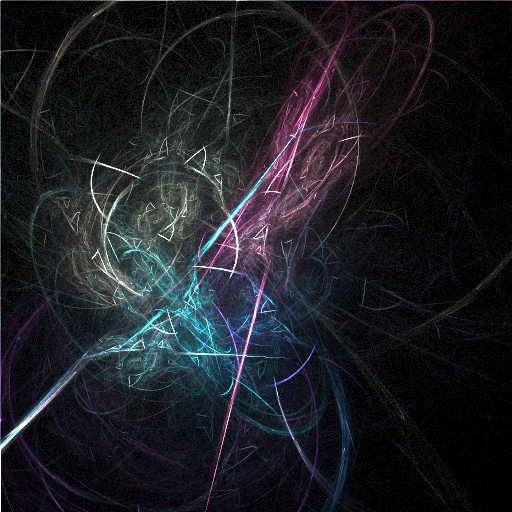
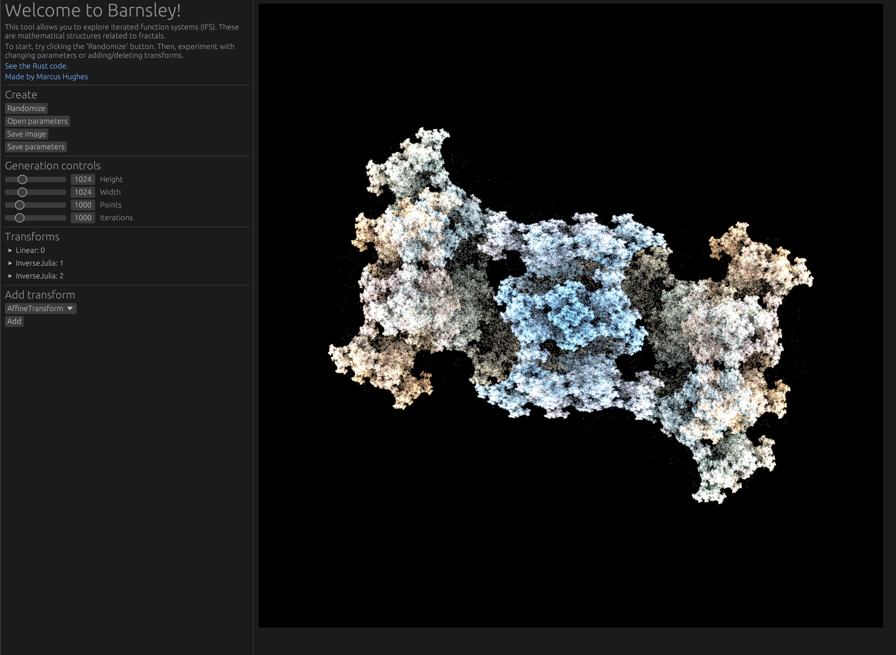
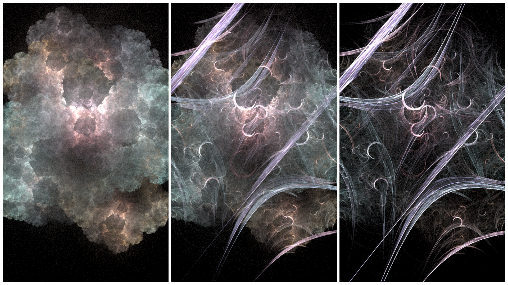
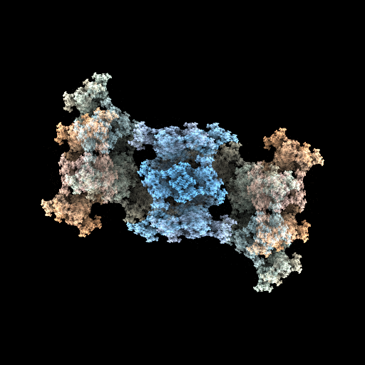
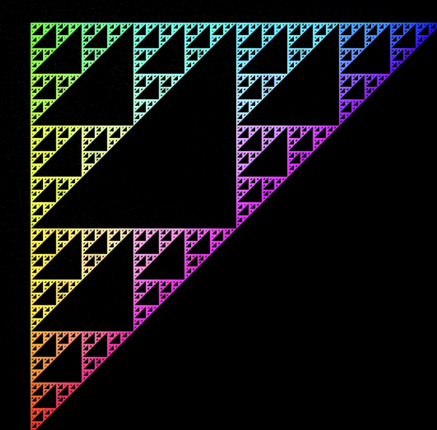

+++
title = 'Barnsley'
date = 2024-01-21
draft = false

[extra]
katex = true
toc = true

[taxonomies]
tags = ["fractal", "math", "programming", "rust"]
+++

[Barnsley](https://jmbhughes.com/barnsley_gui) is a tool I've created to visualize iterated function systems, like the one shown above. You can access it via [the website](https://jmbhughes.com/barnsley_gui) or by building it yourself from source. You can find the source code [for the library](https://github.com/jmbhughes/barnsley) and [for the graphical user interface](https://github.com/jmbhughes/barnsley_gui)(GUI) on GitHub. The GUI is currently implemented using Rust's [egui](https://github.com/emilk/egui). Let's back up a bit though.

## What is an iterated function system?

An iterated function system or IFS is a formal mathematical structure. More technically, it's a set of contractive mappings. They can be used to generate fractals. Fractals are never ending, repeating, mathematical patterns. They occur in nature a lot actually. Trees, lightning, and galaxies all exhibit some fractal patterns. We won't go into great detail of the math in this article, maybe a future aricle will.

I think of an IFS as a set of "transforms" that each have weights and properties. When evaluating an IFS, we will generate a bunch of random points. A transform is just an instruction that tells you how to convert one point to the next one. For example, a transform might say that if you're at the center of an image you should then jump to the right. I've implemented four transforms so far in Barnsley: Linear, Affine, Inverse Julia, and Moebius. They each have a different mathematically form and thus different parameters to adjust.

### Mathematical descriptions of the transforms

Feel free to skip this section if you want to avoid math.

#### Linear

The Linear transform has four real parameters: $a$, $b$, $c$, and $d$. It takes a point $(x, y)$ and mutates it to  $$(ax + by, cx + dy)$$

#### Affine

The Affine transform has six real parameters: $a$, $b$, $c$, $d$, $\mathrm{xshift}$, and $\mathrm{yshift}$. It takes a point $(x,y)$ and mutates it to $$(ax + by + \mathrm{xshift}, cx + dy + \mathrm{yshift})$$

#### Moebius

The Moebius transform has four complex parameters: $a$, $b$, $c$, and $d$. It takes a point $(x, y)$ and defines a complex $z_1 = a + bi$ . We then calculate $$z_2 = \frac{a * z_1 + b}{c * z_1 + d}$$. It ultimately mutates the point to $$(\Re\(z_2\), \Im\(z_2\))$$ where $\Re\(z_2\)$ is the real part of $z_2$ and $\Im\(z_2\)$ is the imaginary part of $z_2$.

#### Inverse Julia

The Inverse Julia transform has two real parameters: $r$ and $\theta$. It's the most complicated transform computationally. It takes a point $(x, y)$ and mutates it by first defining $c = r \cos{\theta} + (r \sin{\theta})i$. We let $z = x + yi$. Then, $z_2 = c - z$. $\theta_2 = \frac{\mathrm{atan2}\(\Im\(z_2\), \Re\(z_2\)\)}{2}$ where $\Re\(z_2\)$ is the real part of $z_2$ and $\Im\(z_2\)$ is the imaginary part of $z_2$. Further,

$$
\mathrm{atan2} (y,x)=
\begin{cases}
    \arctan \left({\frac {y}{x}}\right )& \text{if } x>0 \\ \newline
    \frac {\pi }{2} -\arctan{\frac {x}{y}} & \text{if }y>0 \\ \newline
     -\frac {\pi }{2}-\arctan{\frac {x}{y}} & \text{if }y<0 \\ \newline
     \arctan{\frac {y}{x}} \pm \pi & {\text{if }}x<0 \\ \newline
     \text{undefined} & \text{if }x=0\text{ and }y=0
     \end{cases}
$$

We let $k = -1$ with $\frac{1}{2}$ probability and $k = 1$ with $\frac{1}{2}$ probability so that
$
    s = k \sqrt{\Im\(z_2\) * \Im\(z_2\) + \Re\(z_2\) * \Re\(z_2\)}
$

Finally, $(x, y)$ becomes $$(s  \cos{\theta_2}, s \sin{\theta_2})$$

It's not a simple one, but it's powerful.

### Additional parameters

In addition to the mathematical parameters, each transform has a weight and a color. The weight is used when randomly picking the next transform. Higher weight means it's more likely to be chosen. The color is blended into the point in each iteration.

## How to use the tool

[The website](https://barnsley.dev/) is hopefully straight forward to use. It has the same layout as if you installed the tool on your machine. Note that the website doesn't currently support mobile devices though. For using the tool on a computer, either through the website or installation, see the tricks below.

### Create section

In the "Create" section of the tool, there are a few buttons: randomize, open parameters, save image, and save parameters. Randomize is a fun way to adjust all the parameters in the IFS's transforms at once. It doesn't add or remove transforms though, so if you want to dramatically change the quality of the IFS I'd recommend adding or deleting transforms first. Then, randomize to your heart's content to get different examples.

Once you have found a good IFS, you can save the image as a PNG file and/or save the parameters to a JSON file. I've been annoyed that the file prompt doesn't seem to suggest the file extension in the web browser. Thus, when you save an image you have to put a ".png" on the end of the filename. When you save parameters, you should similarly put ".json" as the extension.

If you want to return to an IFS later, you must save the parameters. When you refresh, it'll be reset. If you've saved the parameters, you can use the open parameters button to select the JSON file you created and revisualize the transform though.

### Adjusting generation properties

Under the "Generation controls" section of the tool, you will see the capability to adjust the image height, image width, the number of points generated in each image, and the number of iterations for each point. Note that changing the number of points or number of iterations could slow down the generation. I find it's nice to start with them set low until I find an interesting transform and then crank them up to make the image quality more impressive.

### Mutating parameters

By mutating the parameters, you can step smoothly between iterated function systems. We can start with a system that looks like the left and mutate parameters slowly to get to the right.

To do this, you just open one of the Transforms and more the slider slowly while saving in between steps.

Such a smooth transition indicates we might be able to make cool animations. See below for some examples and the plans to add the capability to the tool.

### Adding transforms

At the moment, there are only four transform types implemented as described earlier in this article. You can add any of them. If you want to delete one later, you can open that transform in the transforms section and click the delete button.

## Two cool results

There are lots of cool images you can create. One of my favorites is:

I've started using that one as a profile picture in a few places.

You can also generate known fractals, like the Sierpinski Triangle:

## Animations

One thing that isn't in the tool yet is generating animations. I've started playing around with it though. See some examples:

{{ youtube(id="GqB1ZqFCJ5o") }}

{{ youtube(id="CbLH_mDPWsI") }}

{{ youtube(id="Y2CU80XbNPc") }}

{{ youtube(id="ITHzAZbiw4o") }}

## Future plans

I hope to continue developing the application. I may convert away from the egui frontend because it's a bit tedious and not as aesthetically appealing as I'd like. I also want to implement the animation interface so you can visualize animations in the tool easily and save movies. There's a fair bit of tech debt in the codebase too. I've hackishly done many things and realized better ways to do them later. This was a Rust learning project afterall. So, I'll likely try rewriting the codebase and releasing a more stable version that is cleaner. Expect more posts and follow up.
