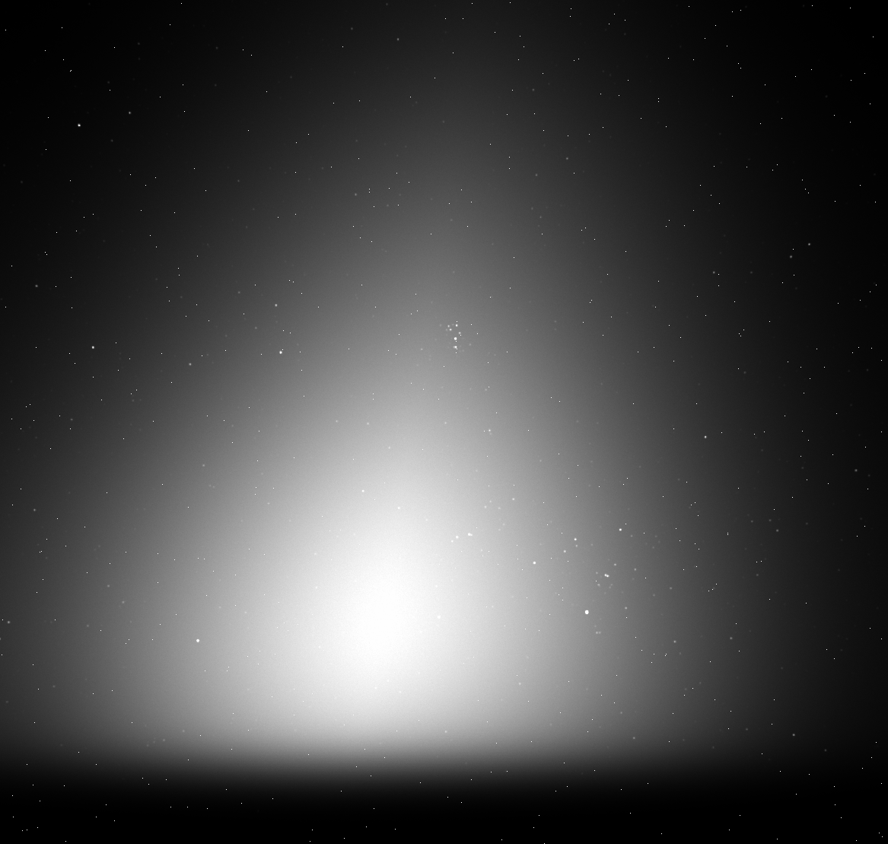

+++
title = 'Converting helioprojective to equatorial'
date = 2024-08-15
draft = false
+++

## Introduction

Solar physics and nighttime astronomy often use different but related coordinate systems.
In solar physics, the helioprojective coordinate system is common. Depending on the subfield
of astronomy one might use a variety of coordinate systems, but one of the most common is equatorial.
These are both spherical geometries.

However, it turns out to be a bit complicated to convert directly between the two. Astropy and SunPy
offer utilities to do the conversion, but I was running into some challenges. I asked Sam Van Kooten for
help, and we came up with this solution. It only applies when the observer is the center of the Earth though.

## Converting a single coordinate

First, we need to know how to convert a single coordinate.

Astropy has a system of transormations that form a computational graph. SunPy augments this with the
common solar coordinate systems. If we try to convert helioprojective to GCRS, we'll be doing several
steps of conversions: Helioprojective to Heliocentric to HeliographicStonyhurst to HCRS to ICRS and finally to GCRS.
This shouldn't really be required. So, we'll register a new transformation that goes from helioprojective straight to GCRS.

```py
import astropy.coordinates
from astropy.io import fits
from astropy.wcs import WCS
import matplotlib.pyplot as plt
import numpy as np
import sunpy.coordinates

def _times_are_equal(time_1: astropy.time.Time, time_2: astropy.time.Time) -> bool:
    # Ripped from sunpy, modified
    # Checks whether times are equal
    if isinstance(time_1, astropy.time.Time) and isinstance(time_2, astropy.time.Time):
        # We explicitly perform the check in TAI to avoid possible numerical precision differences
        # between a time in UTC and the same time after a UTC->TAI->UTC conversion
        return np.all(time_1.tai == time_2.tai)

    # We also deem the times equal if one is None
    return time_1 is None or time_2 is None

def get_p_angle(time: str="now") -> u.deg:
    """
    Get the P angle.

    Return the position (P) angle for the Sun at a specified time, which is the angle between
    geocentric north and solar north as seen from Earth, measured eastward from geocentric north.
    The range of P is +/-26.3 degrees.

    Parameters
    ----------
    time : {parse_time_types}
        Time to use in a parse_time-compatible format

    Returns
    -------
    out : `~astropy.coordinates.Angle`
        The position angle

    """
    obstime = sunpy.coordinates.sun.parse_time(time)

    # Define the frame where its Z axis is aligned with geocentric north
    geocentric = astropy.coordinates.GCRS(obstime=obstime)

    return sunpy.coordinates.sun._sun_north_angle_to_z(geocentric)  # noqa: SLF001

@astropy.coordinates.frame_transform_graph.transform(
    astropy.coordinates.FunctionTransform,
    sunpy.coordinates.Helioprojective,
    astropy.coordinates.GCRS)
def hpc_to_gcrs(HPcoord, GCRSframe):
    if not _times_are_equal(HPcoord.obstime, GCRSframe.obstime):
        raise ValueError("Obstimes are not equal")
    obstime = HPcoord.obstime or GCRSframe.obstime

    # Compute the three angles we need
    position = astropy.coordinates.get_sun(obstime)
    ra, dec = position.ra.rad, position.dec.rad
    p = P(obstime).rad

    # Prepare rotation matrices for each
    p_matrix = np.array([
        [1, 0, 0],
        [0, np.cos(p), -np.sin(p)],
        [0, np.sin(p), np.cos(p)]
    ])

    ra_matrix = np.array([
        [np.cos(ra), -np.sin(ra), 0],
        [np.sin(ra), np.cos(ra), 0],
        [0, 0, 1]
    ])

    dec_matrix = np.array([
        [np.cos(-dec), 0, np.sin(-dec)],
        [0, 1, 0],
        [-np.sin(-dec), 0, np.cos(-dec)]
    ])

    # Compose the matrices
    matrix = ra_matrix @ dec_matrix @ p_matrix

    # Extract the input coordinates and negate the HP latitude,
    # since it increases in the opposite direction from RA.
    if HPcoord._is_2d:
        rep = astropy.coordinates.UnitSphericalRepresentation(
            -HPcoord.Tx, HPcoord.Ty)
    else:
        rep = astropy.coordinates.SphericalRepresentation(
            -HPcoord.Tx, HPcoord.Ty, HPcoord.distance)

    # Apply the tranformation
    rep = rep.to_cartesian()
    rep = rep.transform(matrix)

    # Match the input representation. (If the input was UnitSpherical, meaning there's no
    # distance coordinate, this drops the distance coordinate.)
    rep = rep.represent_as(type(HPcoord.data))

    # Put the computed coordinates into the output frame
    return GCRSframe.realize_frame(rep)
```

The meat of the transformation happens when setting up the matrices in the last function.
They're rotation matrices to go from one to the other using the Sun's right ascension and declination coupled with the solar P angle.
We carefully use the P angle in GCRS instead of SunPy's built-in `sun.P`, which I believe uses ITRS.

We can then use Astropy's infrastructure for conversions.

```py
helio_coord = SkyCoord(1 * u.deg, 3 * u.deg,
                     frame="helioprojective", observer="earth", obstime=date_obs)
eq_coord = old_crval.transform_to(GCRS)
```

It's quite nifty.

## Transforming a WCS from helio to celestial

So let's say you have a world coordinate system in helioprojective. How can you use this to convert to GCRS?

First, you transform the CRVAL using the coordinate transform we just defined.
Then, you transform the PC matrix by rotating by the P angle.

```py
def extract_crota_from_wcs(wcs: WCS) -> u.deg:
    """Extract CROTA from a WCS."""
    return np.arctan2(wcs.wcs.pc[1, 0], wcs.wcs.pc[0, 0]) * u.rad

def calculate_pc_matrix(crota: u.deg, cdelt: (float, float)) -> np.ndarray:
    """
    Calculate a PC matrix given CROTA and CDELT.

    Parameters
    ----------
    crota : float
        rotation angle from the WCS
    cdelt : float
        pixel size from the WCS

    Returns
    -------
    np.ndarray
        PC matrix

    """
    return np.array(
        [
            [np.cos(crota), np.sin(crota) * (cdelt[1] / cdelt[0])],
            [-np.sin(crota) * (cdelt[0] / cdelt[1]), np.cos(crota)],
        ],
    )

def calculate_celestial_wcs_from_helio(
    wcs_helio: WCS,
    date_obs: datetime,
    data_shape: tuple[int, int]) -> WCS:
    """Calculate the celestial WCS from a helio WCS."""
    is_3d = len(data_shape) == 3

    old_crval = SkyCoord(wcs_helio.wcs.crval[0] * u.deg, wcs_helio.wcs.crval[1] * u.deg,
                            frame="helioprojective", observer="earth", obstime=date_obs)
    new_crval = old_crval.transform_to(GCRS)

    rotation_angle = extract_crota_from_wcs(wcs_helio).to(u.rad).value - get_p_angle(date_obs).rad
    new_pc_matrix = calculate_pc_matrix(rotation_angle, wcs_helio.wcs.cdelt)

    cdelt1 = np.abs(wcs_helio.wcs.cdelt[0]) * u.deg
    cdelt2 = np.abs(wcs_helio.wcs.cdelt[1]) * u.deg

    projection_code = wcs_helio.wcs.ctype[0][-3:]

    wcs_celestial = WCS({"CRVAL1": new_crval.ra.to(u.deg).value,
                            "CRVAL2": new_crval.dec.to(u.deg).value,
                            "CUNIT1": "deg",
                            "CUNIT2": "deg",
                            "CRPIX1": wcs_helio.wcs.crpix[0],
                            "CRPIX2": wcs_helio.wcs.crpix[1],
                            "CDELT1": -cdelt1.to(u.deg).value,
                            "CDELT2": cdelt2.to(u.deg).value,
                            "CTYPE1": f"RA---{projection_code}",
                            "CTYPE2": f"DEC--{projection_code}",
                            "PC1_1": new_pc_matrix[0, 0],
                            "PC1_2": new_pc_matrix[1, 0],
                            "PC2_1": new_pc_matrix[0, 1],
                            "PC2_2": new_pc_matrix[1, 1]},
                        )

    if is_3d:
        wcs_celestial = add_stokes_axis_to_wcs(wcs_celestial, 2)

    return wcs_celestial
```

Since this code was developed for PUNCH, we have a polarization axis that makes this WCS 3D in some cases.
So, we handle that here too.

## Transforming the opposite direction

You can reverse this too!

```py
@astropy.coordinates.frame_transform_graph.transform(
    astropy.coordinates.FunctionTransform,
    astropy.coordinates.GCRS,
    sunpy.coordinates.Helioprojective)
def gcrs_to_hpc(GCRScoord, Helioprojective): # noqa: ANN201, N803, ANN001
    """Convert GCRS to HPC."""
    if not _times_are_equal(GCRScoord.obstime, Helioprojective.obstime):
        raise ValueError("Obstimes are not equal")  # noqa: TRY003, EM101
    obstime = GCRScoord.obstime or Helioprojective.obstime

    # Compute the three angles we need
    position = astropy.coordinates.get_sun(obstime)
    ra, dec = position.ra.rad, position.dec.rad
    p = get_p_angle(obstime).rad

    # Prepare rotation matrices for each
    p_matrix = np.array([
        [1, 0, 0],
        [0, np.cos(p), -np.sin(p)],
        [0, np.sin(p), np.cos(p)],
    ])

    ra_matrix = np.array([
        [np.cos(ra), -np.sin(ra), 0],
        [np.sin(ra), np.cos(ra), 0],
        [0, 0, 1],
    ])

    dec_matrix = np.array([
        [np.cos(-dec), 0, np.sin(-dec)],
        [0, 1, 0],
        [-np.sin(-dec), 0, np.cos(-dec)],
    ])

    # Compose the matrices
    old_matrix = ra_matrix @ dec_matrix @ p_matrix
    matrix = np.linalg.inv(old_matrix)

    # Extract the input coordinates and negate the HP latitude,
    # since it increases in the opposite direction from RA.
    if isinstance(GCRScoord.data, astropy.coordinates.UnitSphericalRepresentation):
        rep = astropy.coordinates.UnitSphericalRepresentation(
            GCRScoord.ra, GCRScoord.dec)  # , earth_distance(obstime))
    else:
        rep = astropy.coordinates.SphericalRepresentation(
            GCRScoord.ra, GCRScoord.dec, GCRScoord.distance)

    # Apply the transformation
    rep = rep.to_cartesian()
    rep = rep.transform(matrix)

    # Match the input representation. (If the input was UnitSpherical, meaning there's no
    # distance coordinate, this drops the distance coordinate.)
    rep = rep.represent_as(type(GCRScoord.data))

    if isinstance(rep, astropy.coordinates.UnitSphericalRepresentation):
        rep = astropy.coordinates.UnitSphericalRepresentation(
            -rep.lon, rep.lat)  # , earth_distance(obstime))
    else:
        rep = astropy.coordinates.SphericalRepresentation(
            -rep.lon, rep.lat, rep.distance)

    # Put the computed coordinates into the output frame
    return Helioprojective.realize_frame(rep)

def calculate_helio_wcs_from_celestial(wcs_celestial: WCS,
                                        date_obs: datetime,
                                        data_shape: tuple[int, int]) -> (WCS, float):
    """Calculate the helio WCS from a celestial WCS."""
    is_3d = len(data_shape) == 3

    # we're at the center of the Earth
    test_loc = EarthLocation.from_geocentric(0, 0, 0, unit=u.m)
    test_gcrs = SkyCoord(test_loc.get_gcrs(date_obs))

    # follow the SunPy tutorial from here
    # https://docs.sunpy.org/en/stable/generated/gallery/units_and_coordinates/radec_to_hpc_map.html#sphx-glr-generated-gallery-units-and-coordinates-radec-to-hpc-map-py
    reference_coord = SkyCoord(
        wcs_celestial.wcs.crval[0] * u.Unit(wcs_celestial.wcs.cunit[0]),
        wcs_celestial.wcs.crval[1] * u.Unit(wcs_celestial.wcs.cunit[1]),
        frame="gcrs",
        obstime=date_obs,
        obsgeoloc=test_gcrs.cartesian,
        obsgeovel=test_gcrs.velocity.to_cartesian(),
        distance=test_gcrs.hcrs.distance,
    )

    reference_coord_arcsec = reference_coord.transform_to(frames.Helioprojective(observer=test_gcrs))

    cdelt1 = (np.abs(wcs_celestial.wcs.cdelt[0]) * u.deg).to(u.arcsec)
    cdelt2 = (np.abs(wcs_celestial.wcs.cdelt[1]) * u.deg).to(u.arcsec)

    geocentric = GCRS(obstime=date_obs)
    p_angle = _sun_north_angle_to_z(geocentric)

    rotation_angle = extract_crota_from_wcs(wcs_celestial).to(u.rad).value + get_p_angle(date_obs).rad

    new_header = sunpy.map.make_fitswcs_header(
        data_shape[1:] if is_3d else data_shape,
        reference_coord_arcsec,
        reference_pixel=u.Quantity(
            [wcs_celestial.wcs.crpix[0] - 1, wcs_celestial.wcs.crpix[1] - 1] * u.pixel,
        ),
        scale=u.Quantity([cdelt1, cdelt2] * u.arcsec / u.pix),
        rotation_angle=rotation_angle*u.rad,
        observatory="PUNCH",
        projection_code=wcs_celestial.wcs.ctype[0][-3:],
        unit=u.deg,
    )

    wcs_helio = WCS(new_header)

    if is_3d:
        wcs_helio = astropy.wcs.utils.add_stokes_axis_to_wcs(wcs_helio, 2)

    return wcs_helio, p_angle
```

## Verifying

We have many tests to verify this works properly.
We use the Sun's position to go back and forth with known coordinates.
We also test that given an arbitrary WCS you can convert to the other system and then convert back and
get the original input. All our tests pass.

## Conclusions

This code was developed for PUNCH to go back and forth between helioprojective and GCRS.
It was used to create some synthetic images that are like what PUNCH will see.
Those files include both a helioprojective and equatorial WCS so you can locate things in context of
the Sun and the stars.

Here's a sneak peak of what these images look like.



I'll write more about the synthetic images in the future.
