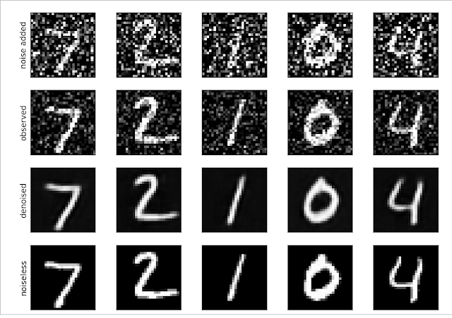

+++
title = 'Training a denoising autoencoder with noisy data'
date = 2019-03-27
draft = false
toc = false
+++

**How do you denoise images with an autoencoder if you don't have a clean version to train with?** One option is to add more noise to your images! In this experiment, I trained an autoencoder with noisy MNIST data. I began with MNIST images on the bottom row, the noiseless versions. To simulate observational data, I added Gaussian noise to the images. In reality, we may never have access to these noiseless images. To train an autoencoder we need an input set with noise and output set without noise so the autoencoder can learn the denoising procedure. An autoencoder could potentially also learn the denoising procedure if we gave it extra noisy images as input and slightly denoised images as output. To simulate this, I added more Gaussian noise to the observations to arrive at the top row. Then, the top row is input and the second row is the output for training. When we want to denoise observations, we use this trained network with the observations as input and the denoised row as our output.  

I am not sure how sensitive this is to an accurate noise model when adding noise or the amount of noise added. In the solar extreme ultraviolet setting, we suffer more from shot/Poisson noise than Gaussian noise. I am unsure how well this approach works under that setting.  

An arguably more elegant approach to this problem is the "Blind Denoising Autoencoder" by Majumdar (2018). It does not require this noise addition or noiseless images.
