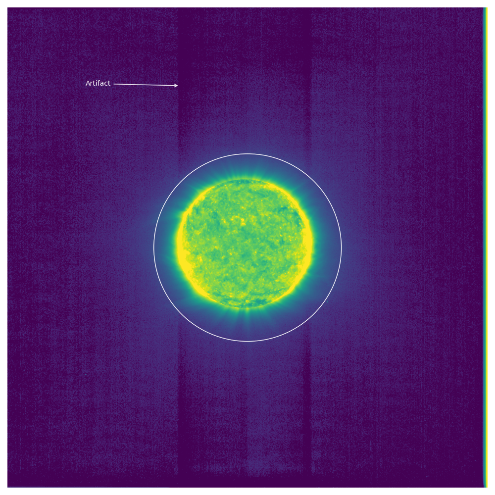
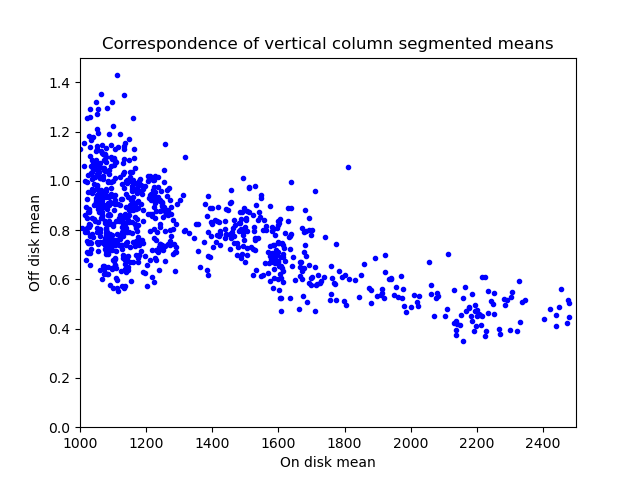

+++
title = 'EUI Artifact Analysis'
date = 2022-04-01
draft = false

[taxonomies]
tags = ["solar", "programming", "python"]
+++

## Introduction

The [Extreme Ultraviolet Imager (EUI) aboard the ESA/NASA Solar Orbiter mission](https://wwwbis.sidc.be/EUI/intro) takes
pictures of the Sun in ultraviolet wavelengths.



Above you can see an annotated version of one of these images.
Specifically this is the image with filename `solo_L1_eui-fsi174-image_20210224T013042238_V02.fits`.  
Notice the artifacts where above and below the solar disk there are darkened stripes.
It's my understanding from a colleague that the cause of these stripes is unknown and they still need to be corrected in the data.
We noticed that where the Sun is brighter the stripe appears to be darker.
The analysis below confirms this.

## Analysis

To measure this phenomenon, I created a mask of where the Sun is. This is denoted
by the white circle in the above image. Anything inside the white circle is considered
on-disk and anything outside is off-disk. Then, I went column by column and computed the
mean value on-disk and off-disk for that column. You end up with the plot below:



It confirms that the off-disk region is dimmer in columns where the on-disk region is brighter.
Maybe this same kind of analysis can be used to correct this artifact?

## Code

Below is the code used in this analysis:

```py
from astropy.io import fits
import matplotlib
import matplotlib.pyplot as plt
import numpy as np

with fits.open("solo_L1_eui-fsi174-image_20210224T013042238_V02.fits") as hdus:
    data = hdus[0].data
    head = hdus[0].header

def create_circular_mask(h, w, center=None, radius=None):
# from https://stackoverflow.com/questions/44865023/how-can-i-create-a-circular-mask-for-a-numpy-array
    if center is None: # use the middle of the image
        center = (int(w/2), int(h/2))
    if radius is None: # use the smallest distance between center and image walls
        radius = min(center[0], center[1], w-center[0], h-center[1])

    Y, X = np.ogrid[:h, :w]
    dist_from_center = np.sqrt((X - center[0])**2 + (Y-center[1])**2)

    mask = dist_from_center <= radius
    return mask

# Show the example image with annotations
fig, ax = plt.subplots(figsize=(10, 10))
c = plt.Circle((1536, 1536), 600, fill = False, color='white')
ax.add_artist(c)
ax.imshow(np.power(data.astype(float), 0.25), vmin=0, vmax=8)
ax.annotate("Artifact", xy=(1100, 500), xytext=(500, 500),
            arrowprops=dict(arrowstyle="->", color="white"), color="white")
ax.set_axis_off()
fig.tight_layout()
fig.show()

# Create the masks used for analysis
mask = create_circular_mask(data.shape[0], data.shape[1],
  center=(1536, 1536),
  radius=600)

disk_data = data.copy().astype(float)
disk_data[np.logical_not(mask)] = np.nan

off_data = data.copy().astype(float)
off_data[mask] = np.nan

# Make the measurements
disk_measurements, off_measurements = [], []
for i in range(data.shape[0]):
    disk_measurement = np.nanmean(disk_data[:, i])
    off_measurement = np.nanmean(off_data[:, i])
    if disk_measurement > 0:
        disk_measurements.append(disk_measurement)
        off_measurements.append(off_measurement)

# Plot the analysis
fig, ax = plt.subplots()
ax.plot(disk_measurements, off_measurements, 'b.')
ax.set_xlabel("On disk mean")
ax.set_ylabel("Off disk mean")
ax.set_title("Correspondence of vertical column segmented means")
ax.set_ylim((0, 1.5))
ax.set_xlim((1000, 2500))
fig.show()
```
