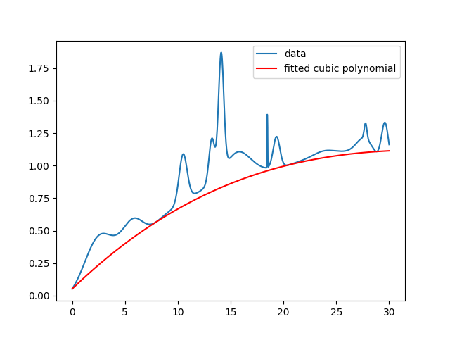
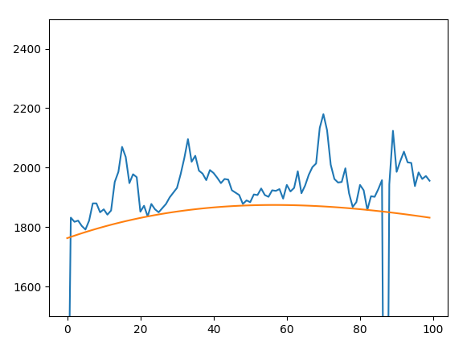

+++
title = 'Best understimate cubic fitting'
date = 2024-10-21
description = "Use quadratic programming to fit a cubic polynomial below a curve"

[taxonomies]
tags = ["programming", "python", "math"]

[extra]
katex = true
+++

I was recently confronted with a problem: Given some curve or collection of data points, determine the polynomial that fits closest to the data but lies completely below it.

The solution I came up with: Use quadratic programming!

Quadratic programming is the mathematical process of solving optimization problems involving quadratic functions and linear constraints. In particular, they come in the form:

$$
\textrm{minimize } \frac{1}{2} x^T Q x + c^T x \\
\textrm{ subject to } Ax \preceq b
$$

If you think about least squares, you can [convert least squares to a quadratic programming problem](https://scaron.info/blog/conversion-from-least-squares-to-quadratic-programming.html). This allows us to add constraints, namely the constraint that our solution must lie below the curve.

After we formalize the problem and write some code to use an off-the-shelf quadratic program solver, in this case `quadprog`, we have a solution right away.

```py
import quadprog
import numpy as np

def fit_cubic(x, y):    
    # use different powers for a different degree polynomial
    A = np.c_[np.power(x, 3), np.square(x), x, np.ones(len(x))]  

    G = A.T @ A
    a = A.T @ -y
    C = A.T
    b = -y
    coeffs = quadprog.solve_qp(G, a, C, b)[0]
    
    return -coeffs
```

It's beautifully short because we rely on `quadprog` to work the magic.

To test, we can simulate a curve using the function below:

```py
import scipy.stats as ss

def random_hills(x, num_hills, width_distribution):
    centers = np.random.uniform(np.min(x), 
        np.max(x), 
        size=num_hills)
    widths = np.random.normal(width_distribution[0], 
        width_distribution[1], 
        size=num_hills)

    components = [ss.norm(center, width) 
        for center, width in zip(centers, widths)]
    
    weights = np.random.uniform(0, 1, size=num_hills)
    weights = weights / np.sum(weights) # ensuring they sum to 1
    
    return np.nansum([component.pdf(x) * weight 
        for weight, component in zip(weights, components)], axis=0)
```

It's just building a Gaussian mixture model manually given `num_hills` Gaussians with widths drawn from the `width_distribution` over the input domain `x`.
The `width_distribution = (width_mean, width_standard_deviation)`.

Then, our script to solve this is:

```py  
# replace with whatever curve you have
x = np.linspace(0, 30, 100)
y = random_hills(x, 50, (1, 1.5))*10 + np.sin(x/17)  

# then fit!
cubic_coeffs = fit_cubic(x, curve)
```

We can quickly visualize this with Matplotlib.

```py
import matplotlib.pyplot as plt

fig, ax = plt.subplots()
ax.plot(x, y, label="data")
ax.plot(x, np.polyval(cubic_coeffs, x), 
    c='r', 
    label="fitted cubic polynomial")
fig.legend()
fig.show()
```

Then, we get something like:



In my particular case, I'm working with noisy data. So there will sometimes be major outliers stemming from bad pixels in images.
My quick solution is just to throw out outliers less than three standard deviations by filtering the input $x$ and $y$.
This results in a fit like the following:



We're using this to build better F-corona models for PUNCH.

More to come on that!

All together, the script is:

```py
import quadprog
import numpy as np
import scipy.stats as ss
import matplotlib.pyplot as plt

def fit_cubic(x, y):
    # use different powers for a different degree polynomial
    A = np.c_[np.power(x, 3), np.square(x), x, np.ones(len(x))]

    y = y
    G = A.T @ A
    a = A.T @ -y
    C = A.T
    b = -y
    coeffs = quadprog.solve_qp(G, a, C, b)[0]

    return -coeffs


def random_hills(x, num_hills, width_distribution):
    centers = np.random.uniform(np.min(x), np.max(x), size=num_hills)
    widths = np.random.normal(width_distribution[0], width_distribution[1], size=num_hills)

    components = [ss.norm(center, width) for center, width in zip(centers, widths)]

    weights = np.random.uniform(0, 1, size=num_hills)
    weights = weights / np.sum(weights)  # ensuring they sum to 1

    return np.nansum([component.pdf(x) * weight for weight, component in zip(weights, components)], axis=0)

if __name__ == "__main__":
    x = np.linspace(0, 30, 1000)
    y = random_hills(x, 50, (1, 1.5)) * 10 + np.sin(x / 17)  # or whatever curve you want
    cubic_coeffs = fit_cubic(x, y)

    fig, ax = plt.subplots()
    ax.plot(x, y, label="data")
    ax.plot(x, np.polyval(cubic_coeffs, x), c='r', label="fitted cubic polynomial")
    ax.legend()
    plt.show()
```
