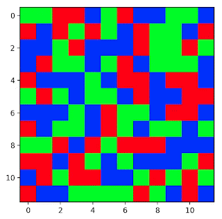
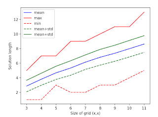

+++
title = 'Flood puzzle'
date = 2019-09-16
draft = false
toc = false

[taxonomies]
tags = ["math"]
+++

I stumbled upon a game called Flood. It's a simple enough game. You start with a grid of random colors. Then, you change the color of contiguous region formed from the upper left corner until you have flooded the entire grid with one color. I wrote some [code](https://github.com/jmbhughes/flood) and have been tinkering around some.

The most naive solver is a breadth first search. So, I did that. Below you see the solution length for a grid size of varying size with only three colors.

This search breaks down at large grid size because it's so slow. Some kind of heuristic approach would perform better, but can you prove it's within some epsilon of optimal? What is the expected optimal solution length? I think that should be proveable theoretically since you just have a uniform grid and can constrain the growth rate. I will likely return and do that.
