+++
title = 'Creating fake APOD pictures'
date = 2022-05-30
draft = false

[taxonomies]
tags = ["programming", "python", "machine learning"]

[extra]
toc = true
+++

## Introduction

I volunteer to teach programming to two high school students through a non-profit
called [The Coding School](https://the-cs.org/), specifically the
[CodeConnects](https://codeconnects.org/) program. One of my students is taking
AP Computer Science at the same time. His teacher requires all the students to
complete a final project of their choosing; they have complete freedom in
picking the project except it has to be approved by the teacher. (That sounds
  like an awesome teacher by the way, encouraging students to learn on their own
  by pursuing their own passion projects. That's how you really learn.)

I've been teaching machine learning to this particular student, so we started
brainstorming ML projects. Ultimately, he wanted to use a generative adversarial
network (GAN) to generate fake space pictures. We were inspired by
[several](https://arxiv.org/pdf/2111.11578.pdf)
 [other](https://arxiv.org/pdf/1904.10286v1.pdf)
 [projects](https://arxiv.org/pdf/1811.03081.pdf) conducted by professional
 astronomers and computer scientists and reported in the academic literature.
I was excited by this project because it unites two of my passions: machine learning
and astronomy.

We decided the project would use images from [NASA's Astronomy Picture of the Day](https://apod.nasa.gov/apod/astropix.html) (APOD).
They are, after all, some of the best images of our universe!

We outlined the project in a few steps:

1. Teach him about how GANs work
2. Implement a basic GAN on a common dataset like MNIST
3. Scrape APOD for all pictures that meet our criteria
4. Train a sophisticated GAN to fake APOD!

I won't go into too much detail about steps 1 and 2 here and focus most on
steps 3 and 4.

## Scraping APOD

It turns out getting images from APOD is easier than I expected. Our initial
approach was to parse [the archive](https://apod.nasa.gov/apod/archivepix.html)
as a jumping off point. However, we quickly noticed that all the links had a
standard form. To get the image from May 25th, 2022 you simply go to
`https://apod.nasa.gov/apod/ap220525.html`. The URL is just `ap` followed by
a two digit year code, a two digit month code, and a two digit day code. This
is easily generated by a f-string in Python.

Once we got to a specific day's page, there's only one image on it. So, we
can just search the HTML for the only `img` tag and get the link to the image
resource. He only wanted to recreate deep space pictures, i.e. no panoramic Earth night sky or
human creations should be in the pictures. We thought the easiest way to narrow
down the images without manually inspecting them all was to restrict ourselves
to images that had "NGC" in their page description. NGC stands for New General
Catalogue of Nebulae and Clusters of Stars. It was created in 1888 and has
thousands of nebulae, star clusters, and galaxies in it.

So, we got to writing code.

Altogether, this results in a nice, short script as shown below.

```py
import requests
from bs4 import BeautifulSoup
from datetime import datetime, timedelta

# set the time window you want to fetch images for
start = datetime(2015, 1, 1)
end = datetime(2022, 5, 26)

# these are the base links used
link = "https://apod.nasa.gov/apod/archivepix.html"
prefix = "https://apod.nasa.gov/apod/"

def date_range(start, end):
    # Truncate the hours, minutes, and seconds
    sdate = datetime(start.year, start.month, start.day)
    edate = datetime(end.year, end.month, end.day)

    # compute all dates in that difference
    delta: timedelta = edate - sdate
    return [start + timedelta(days=i) for i in range(delta.days + 1)]

for day in date_range(start,end):
    day_str = day.strftime("ap%y%m%d")
    day_link = prefix+day_str+".html"
    soup = requests.get(day_link)
    if ("NGC" in soup.text):
        try:
            soupL1 = BeautifulSoup(soup.text, features="html.parser")
            pic_suffix = soupL1.find("img")['src']
            full_link = prefix+"/"+pic_suffix
            pic_page = requests.get(full_link)
            file = open(day_str+".jpg", 'wb')
            file.write(bytes(pic_page.content))
            file.close()
            print(full_link)
        except:  # the page likely didn't have a jpg
            print(f"failed for {day}")
```

Below you can see an example of images scraped from APOD. They're beautifully
crisp and colorful images of just the deep space objects we were after. Remember
this image for later so you can compare it to the results we achieved.

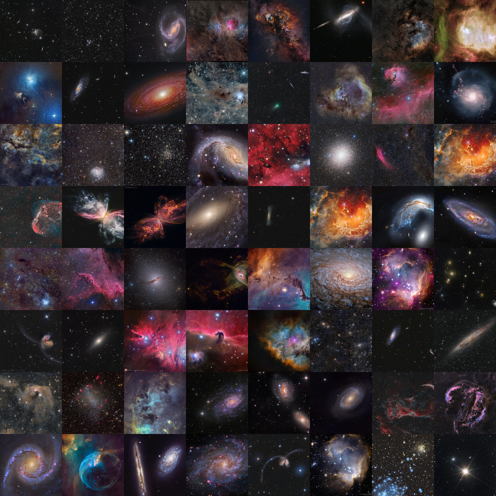

Altogether, we settled on using 454 images.

## Machine learning time

Once we had our dataset of images, we were ready to do some machine learning. First,
we needed to preprocess and standardize the images for the GAN. Then,
we got to the actual training.

### Pre-processing

I thought it would be easiest if all the images were small and the same size.
Thus, we wrote the script below to first crop the images and then resize them
to a standard size. Note all the training images have been placed in a directory
called `raw`, and we write out the resized images to folders with names formatted
`binned_{size}`, e.g. `binned_512` for images resized to 512x512 pixels.

```py
from PIL import Image
from glob import glob
import os

# for the specified resolutions
for size in [128, 256, 512, 1024]:
    os.mkdir(f"binned_{size}")
    fns = glob("raw/*.jpg")
    for fn in fns:  # bin all the images
        out_fn = os.path.join("binned_{size}", os.path.basename(fn))
        img = Image.open(fn).convert("RGB")
        min_dimension = min(img.width, img.height)
        img.crop((0, 0, min_dimension, min_dimension)).resize((size, size)).save(out_fn)
```

We cropped first to avoid squashing the images in weird ways that would distort
the astronomical objects within them.

### Training

There's a plethora of GAN architectures to choose from, but we had some special
constraints: only 454 small images and limited compute power. We were originally
going to use his PC, but ultimately ended up training it on Google Colab (more
  on this later).
Thus, we tried using the "lighteight GAN" model by [Liu eta al. 2021](https://arxiv.org/abs/2101.04775) because "the model converges from scratch with just
a few hours of training on a single RTX-2080 GPU, and has a consistent performance, even with less than 100 training samples."
They have an official PyTorch implementation available [here on GitHub](https://github.com/odegeasslbc/FastGAN-pytorch),
but we decided to go with [this implementation](https://github.com/lucidrains/lightweight-gan) instead
because it was easy to set up and get running. It's a very professional implementation; thank you to its author Phil Wang.

To run the code we simply fired up a GPU instance of Google Colab,
ran `pip install lightweight-gan`, and then ran

```bash
lightweight_gan --data /content/drive/MyDrive/galaxygan/binned_512 \
  --results_dir /content/drive/MyDrive/galaxygan/ \
  --models_dir /content/drive/MyDrive/galaxygan/ \
  --name out_512 \
  --batch-size 16 \
  --gradient-accumulate-every 4 \
  --num-train-steps 10000 \
  --image-size 512 \
  --save-every 100 \
  --evaluate-every 10
```

While the command is long, it was easy to construct and ran like a charm with
background execution in Google Colab.

We waited for about 18 hours, and the run had finished! We could see intermediate
results all along the way and had model checkpoints every 100 iterations in case anything failed.

## Results

Now for the exciting part! Let's look at some results. They aren't as stunningly
perfect as I'd hoped, but they are impressive and show promise.
We'll consider the fidelity of images, the diversity of the fakes, the ability to
interpolate the latent space, and the "average", fake APOD.

### Training process

The video below shows the progress training. It starts with crazy noise images
and rapid evolution in the first epochs and results in the final model at the video's end.
Feel free to adjust the speed in YouTube to get a slower or faster animation.

{{ youtube(id="Ti7xKwgkgOk") }}

About a third of the way into the 10,000 trainings steps, we can already see images that are
reminiscent of APOD pictures. I let it keep training though to see if we got improved
images, which I believe we did.

### Fidelity

Take a look for yourself below at one of the fake images generated.

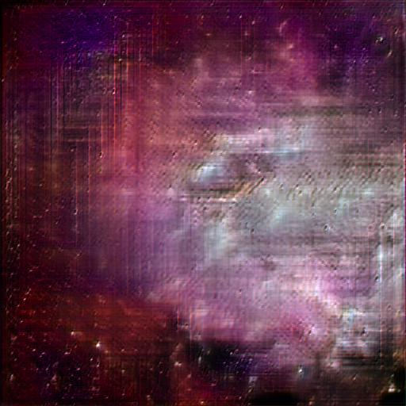

It clearly resembles a nebula, but it exhibits extensive checkboard artifacts.
You can see the convolution grid. If you want to read more about these kinds
of artifacts and what can be done about them check out [this fantastic article by Odena et al. (2016)](https://www.google.com/url?q=http://doi.org/10.23915/distill.00003&sa=D&source=editors&ust=1653946145635417&usg=AOvVaw2crVlgSbt4oYDbQep99KE9)
and [another by Aitken et al. (2017)](https://arxiv.org/ftp/arxiv/papers/1707/1707.02937.pdf).

We are content with the current result as first step, and are interested in
resolving this issue potentially in a future iteration.

### Diversity

Do the images capture the diversity of astronomical objects in the source data?
You can see below an array of fake examples.

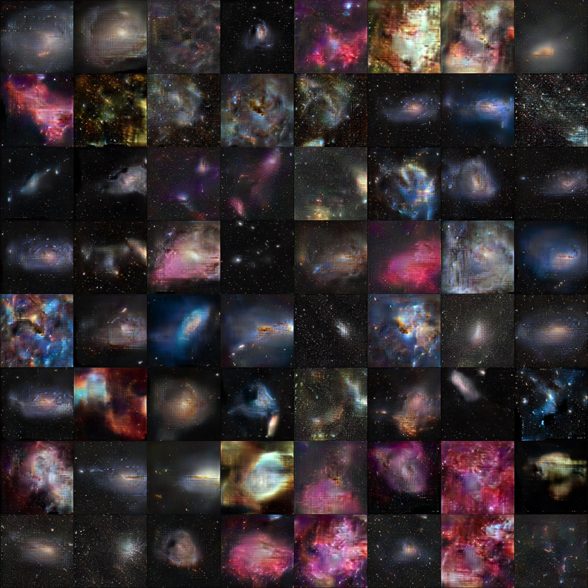

They do seem to cover the main categories we expect. I don't see anything that looks
alien; most images seem realistic-ish.

#### Nebulas

Here are three nebulas.

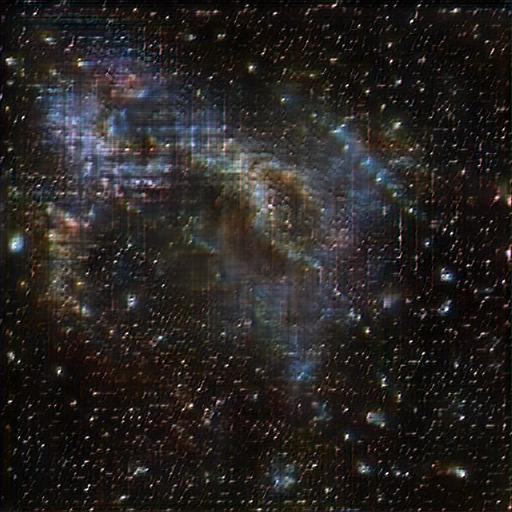

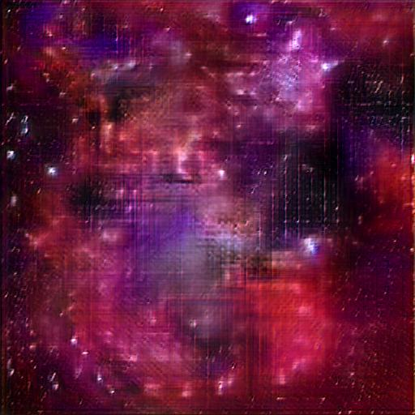

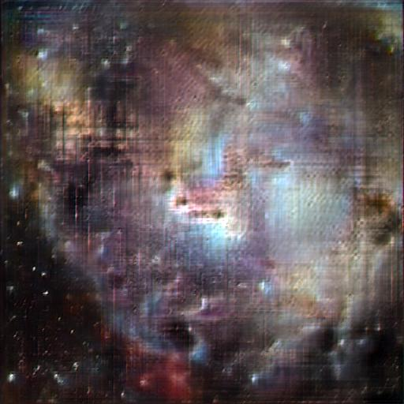

We see a variety of color and structure in them.

#### Star fields

The results include images that are pure starfields. I haven't done any official
analysis, but it appears to me that the stars are much more regularly distributed
in space than one might expect in space.

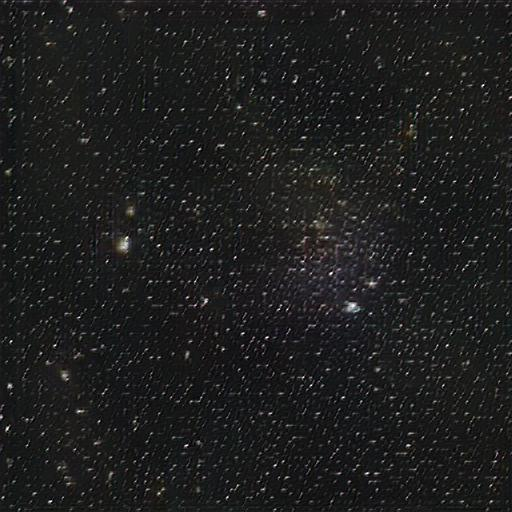

#### Galaxies

I feel there's a shortage of galaxies, especially highly structure spiral galaxies
in our results. I'm not sure if that's just a bias from the APOD sample, if it's
a consequence of the GAN, or if I'm just crazy and there's no shortage.

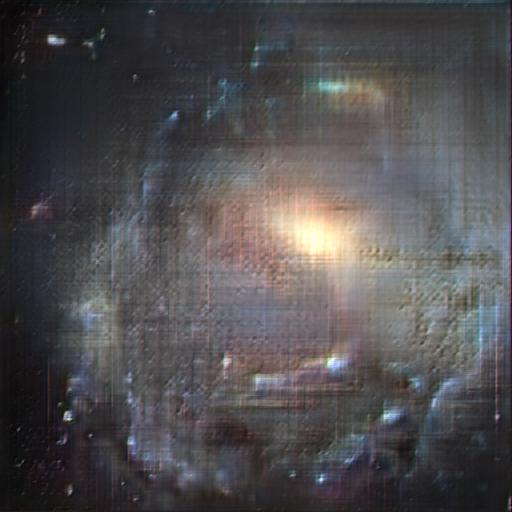

We also see interesting galaxy groups!

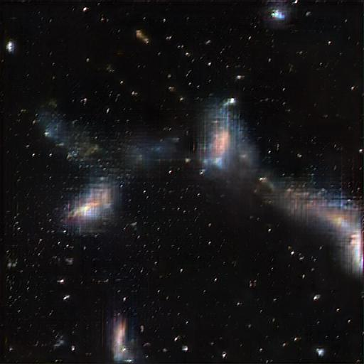

#### Clusters

Globular clusters can be found in the fake results too.

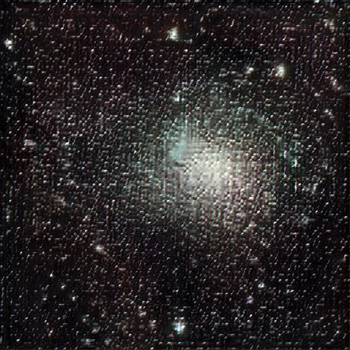

Thus, overall it seems to reconstruct all the categories, albeit with a potential bias.

### Interpolation

One very cool thing that this implementation of lightweight-gan does is create
interpolation examples. In the image below, there are 8 images on the top row that we can
think of as starting points and 8 images on the bottom row we can think of as ending points.
Then, the code interpolates in the model's latent space to construct representative images
between the start and end. I find the 6th column most fascinating in this example. We interpolate
from a brilliant nebula to what appears to be a small galaxy.

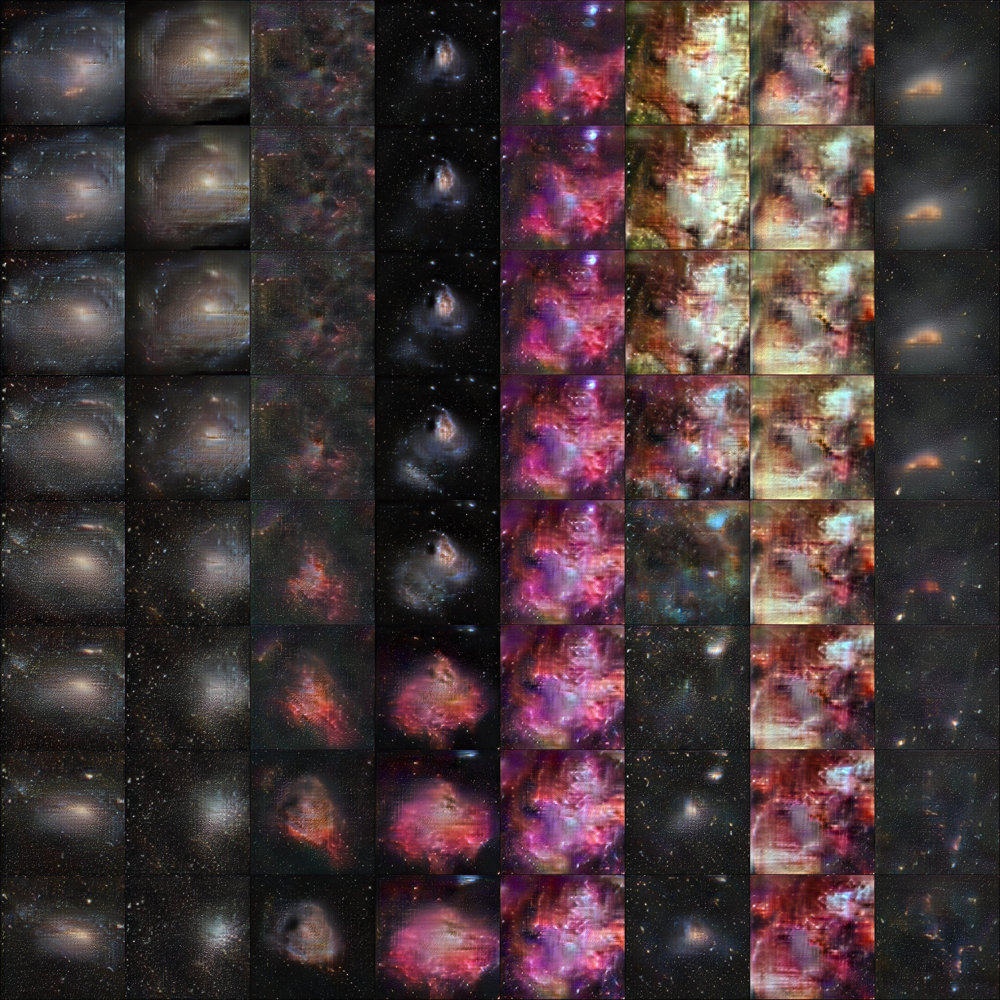

It does seem that there are harsh transitions between the start and end point when
they're dramatically different. I'm not sure what this means about the model though.

### Average

We can also explore the average fake image. We took a sample of 1000 images
and merely averaged them together. You end up with the image below.

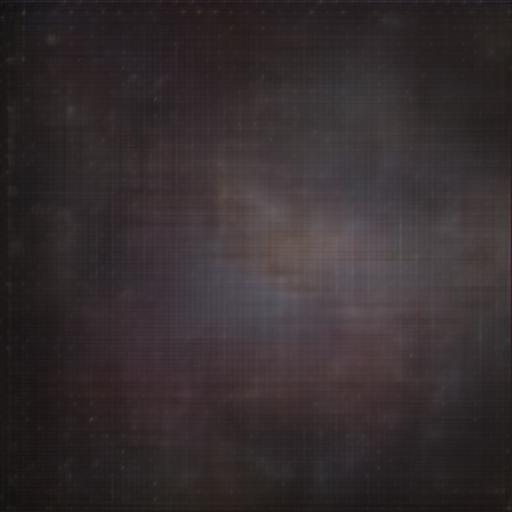

There's some nebulosity in the average; I might have expected it to be nearly black.

## Using Google Colab

Originally, we were going to train the model on the student's computer. However,
we started running into errors and resolving those errors just resulted in more
errors. Ultimately, there was some error about insufficient GPU memory. It might
be resolvable, but we thought this might be a good chance to try out Google Colab.

I purchased a Pro+ subscription since I knew we'd have a long-running training session.
I believe background execution was necessary because when I tried training without it, the runtime timed out.
It's possible I just did something wrong. Regardless, Colab Pro+ did the trick. We actually trained
twice, once on a 128x128 sized images and then for the results shown here on 512x512 images.

Between the two training sessions, I found I had to wait because I'd used up my
GPU allotment. It's frustrating that Colab doesn't tell you how long you'll have to
wait. I just tried several times in the next 24 hours, and it eventually let me
start another GPU runtime. I've heard that these wait times increase the more
you use Colab. I hope not.

I was very happy with how Google Colab integrates with Google Drive. I could
output the images and model checkpoints to a shared directory on Google Drive.
We could both see the results. I woke up in the middle of the night during training
some and was able to grab my phone from the night stand and look at intermediate results.
I knew it was still training without even getting up. I also struggled to contain
my excitement at the results and get back to sleep then.

I'll keep trying it out because there are more things I would like
to train for work projects. Maybe I'll write a full post in a few months about
my overall impression of Colab's paid tiers.

## Future work

There are many avenues to explore:

- Simply train the model for longer
- Remove the checkerboarding for higher fidelity images
- Try other GAN architectures to compare performance
- Analyze the distribution of image object types to answer the question: "Do we capture a representative sample of APOD?"
- Your suggestions!

## Conclusion

This was an exciting small project that has promising results! I hope my student
had as much fun doing it as I did. We're open to suggestions from you, the reader, about what else we could do.
