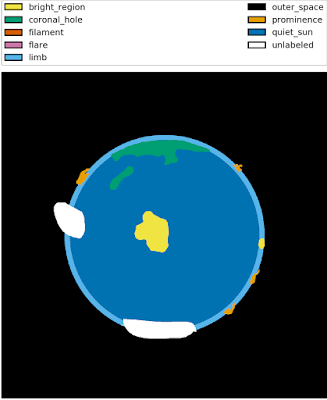
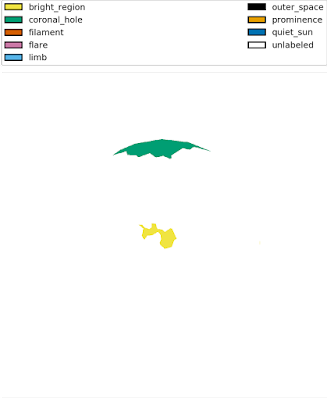

+++
title = 'Generate Thematic Maps from Heliophysics Event Knowledgebase'
date = 2019-02-25
draft = false
toc = false

[taxonomies]
tags = ["solar", "programming", "python"]
+++

The below script will allow you to generate thematic maps from the valuable [Heliophysics Event Knowledgebase](https://www.lmsal.com/hek/) (HEK). I have written it to take a SUVI thematic map as input and output only [Spatial Possibilistic Clustering Algorithm](https://arxiv.org/abs/1208.1483) [(SPoCA)](https://arxiv.org/abs/1208.1483) coronal hole and bright region patches in HEK but would be willing to help assist others to modify the script as needed.  



Expert labeled map



SPoCA map from HEK

The script can be found below and bundled with [smachy](https://github.com/jmbhughes/smachy), my solar image segmentation toolkit.

```py
"""
Given a thematic map from SUVI this script queries HEK and creates a similar SPoCA thematic map with only
coronal holes and active regions.
"""
from datetime import timedelta
import numpy as np
import argparse

import astropy.units as u
from astropy.coordinates import SkyCoord
from astropy.io import fits

import sunpy.map
from sunpy.net import hek
from sunpy.time import parse_time

from skimage.draw import polygon


def get_args():
    """ process the script arguments """
    ap = argparse.ArgumentParser()
    ap.add_argument("image", help="suvi thematic map to fetch hek data for")
    ap.add_argument("-v", "--verbose", action="store_true",
                    help="prints detailed status information")
    args = vars(ap.parse_args())
    return args


def query_hek(query_time, delta=timedelta(minutes=5)):
    """ query hek client for features around the time of the image """
    hek_client = hek.HEKClient()
    start_time = query_time - delta
    end_time = query_time + delta
    responses = hek_client.search(hek.attrs.Time(start_time, end_time))
    return responses


def generate_pixels(response, image_map):
    """ determines pixels for coronal hole feature """
    p1 = response["hpc_boundcc"][9:-2]
    p2 = p1.split(',')
    p3 = [v.split(" ") for v in p2]

    coords = SkyCoord(
        [(float(v[0]), float(v[1])) * u.arcsec for v in p3],
        frame=image_map.coordinate_frame)

    xs, ys = image_map.world_to_pixel(coords)
    xs, ys = xs.value, ys.value
    xx, yy = polygon(xs, ys)
    return yy, xx


if __name__ == "__main__":
    # process the arguments
    args = get_args()

    # open the suvi thematic map
    with fits.open(args['image']) as hdu:
        header = hdu[0].header
        labels = hdu[1].data
    image_map = sunpy.map.Map(args['image'])
    spoca_map = np.zeros_like(image_map.data).astype(np.uint8)

    # query hek for that time
    query_time = parse_time(header['date-beg'])
    responses = query_hek(query_time)

    # separate the coronal holes and active regions from SPoCA for drawing
    coronal_holes = [r for r in responses if r['event_type'] == 'CH' and r['frm_name'] == 'SPoCA']
    active_regions = [r for r in responses if r['event_type'] == 'AR' and r['frm_name'] == 'SPoCA']

    # draw the coronal holes
    for ch in coronal_holes:
        xx, yy = generate_pixels(ch, image_map)
        ch_index = [i for i, label in labels if label == 'coronal_hole'][0]
        spoca_map[xx, yy] = ch_index

    # draw the active regions
    for ar in active_regions:
        xx, yy = generate_pixels(ar, image_map)
        br_index = [i for i, label in labels if label == 'bright_region'][0]
        spoca_map[xx, yy] = br_index

    # save to a file
    fits.writeto(args['image'].split(".fits")[0] + "-hek.fits",
                 spoca_map,
                 header,
                 overwrite=True)
```
