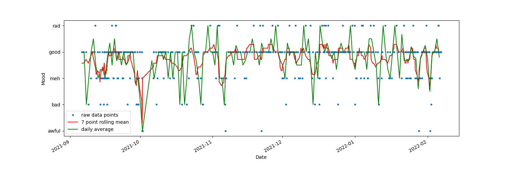

+++
title = 'Mood tracking: first plots'
date = 2022-02-26
draft = false
toc = false

[taxonomies]
tags = ["personal"]
+++

For some time now, I've been using the app [Daylio](https://daylio.net/) to track my mood. It allows me to rate
my mood on a 5 point scale: awful, bad, meh, good, and rad. I can also put pictures, notes, or log what activities are
related to that mood at the same time. It's quite a nifty little app.

I just decided to download the data and start examining it more critically.
I hope to build a small set of tools to automatically process all the data and interpret conclusions. I have made
my first plots of just the data as a whole shown below:

## Plots

**Version 1:**

This is just made in `matplotlib` using `pandas` to aggregate the data into 7 point rolling means and daily averages.

**Version 2:**

Here I used the Python package `calmap` to visualize the data as a calendar heatmap. The red points are the lowest,
yellow are medium, and green are the highest. I'm not sure that I love the colormap,
but I can experiment with that some more.

I've been reading [Emotional: How feelings shape our thinking](https://www.amazon.com/Emotional-How-Feelings-Shape-Thinking-ebook/dp/B091PJ8BSJ/ref=sr_1_3?keywords=emotional&qid=1644201936&sr=8-3)
by Leonard Mlodinow. I've found it fascinating as I try to understand these plots and my emotions in general.
It seems that I'm measuring the valence (aka the negativity or positivity) of something called "core affect."
I'm curious how I can use this data in an interventional sense to improve my life.

Once I finish the book and make some more plots, I'd like to maybe write a Medium post about all this.
(That would be my first Medium post ever! It might get more attention than my little blog here.)
I believe people in the Quantified Self community would find it interesting.
